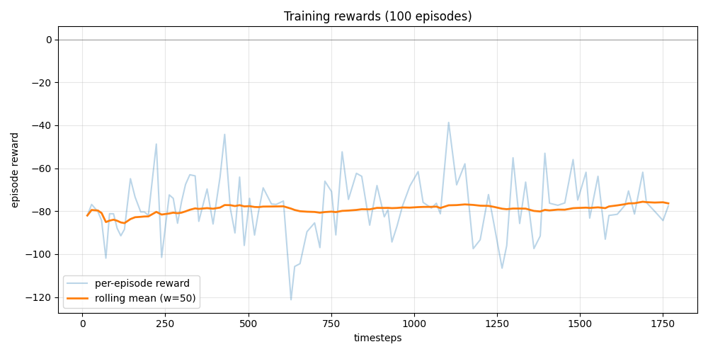

# Training Report — chain_v2

## Files

- `maskppo_chain_v2.zip`: MISSING (0 bytes)
- `maskppo_chain_v2_best.zip`: yes (3,877,684 bytes)
- `maskppo_chain_v2_episodes.jsonl`: yes (5,772 bytes)
- `maskppo_chain_v2_info.jsonl`: MISSING (0 bytes)

## Training reward summary

- Episodes: **100**
- Reward mean: **-78.12** (stdev 14.0)
- Reward min/max: -121.3 / -38.7
- Length mean/max: 17.6 / 25
- First 20 vs last 20 mean: -81.0 -> -74.4  (delta **+6.6**)
- Best training episode: #67 reward=-38.7

## Training curve

## Eval

skipped per --skip-eval
