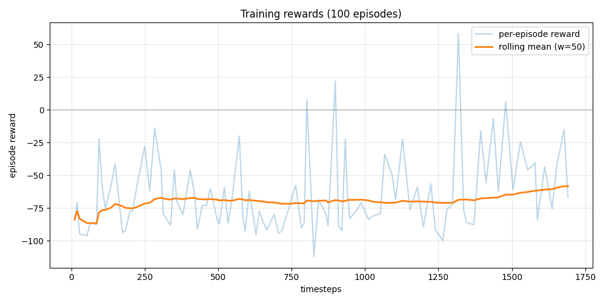

# Training Report — chain_v5

## Files

- `maskppo_chain_v5.zip`: yes (3,877,688 bytes)
- `maskppo_chain_v5_best.zip`: yes (3,877,685 bytes)
- `maskppo_chain_v5_episodes.jsonl`: yes (5,725 bytes)
- `maskppo_chain_v5_info.jsonl`: yes (412,191 bytes)

## Training reward summary

- Episodes: **100**
- Reward mean: **-64.92** (stdev 29.1)
- Reward min/max: -112.0 / +58.2
- Length mean/max: 16.9 / 25
- First 20 vs last 20 mean: -68.1 -> -44.9  (delta **+23.3**)
- Best training episode: #82 reward=+58.2

## Episode info summary

- Episodes with full info: **649**
- Reached target: 0/649 (0%)
- Output gears mean/max: 0.0 / 0

### Mean reward components (last 20 episodes)

- active_assemblers: +0.00
- active_belts: +0.25
- active_inserters: +0.15
- activity_reward: +0.88
- base: -100.00
- belt_pairs: +3.10
- chain_points: +45.30
- functional_inserter_bonus: +5.00
- functional_inserters: +0.50
- gears_in_chest: +0.00
- gears_in_inserters: +0.00
- gears_on_belts: +0.00
- gears_total: +0.00
- good_drops: +1.75
- good_pickups: +1.85
- invalid_action_penalty: -1.40
- invalid_actions: +1.40
- neighborhood_pts: +45.30
- per_gear_reward: +0.00
- useless_belt_penalty: -26.75
- useless_belts: +5.35

## Training curve



## Eval — 8 deterministic episodes against best ckpt

```
[eval] loading checkpoints\maskppo_chain_v5_best.zip
[eval] ep 1/8: reward=-64.5  gears=0  reached=False  chain_pts=30  ticks=900
[eval] ep 2/8: reward=-64.5  gears=0  reached=False  chain_pts=30  ticks=900
[eval] ep 3/8: reward=-64.5  gears=0  reached=False  chain_pts=30  ticks=900
[eval] ep 4/8: reward=-64.5  gears=0  reached=False  chain_pts=30  ticks=900
[eval] ep 5/8: reward=-64.5  gears=0  reached=False  chain_pts=30  ticks=900
[eval] ep 6/8: reward=-64.5  gears=0  reached=False  chain_pts=30  ticks=900
[eval] ep 7/8: reward=-64.5  gears=0  reached=False  chain_pts=30  ticks=900
[eval] ep 8/8: reward=-64.5  gears=0  reached=False  chain_pts=30  ticks=900

[eval] === summary over 8 episodes ===
[eval] reward: mean=-64.5  stdev=0.0  min=-64.5  max=-64.5
[eval] gears produced: mean=0.0  max=0
[eval] reached target: 0/8 (0%)
[eval] chain_pts: mean=30.0  max=30

```
